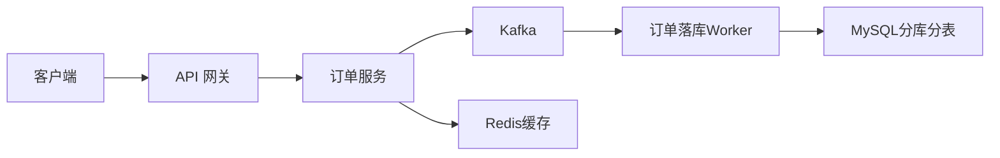
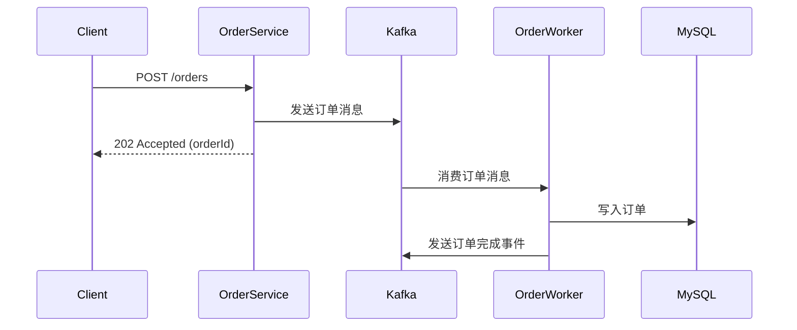
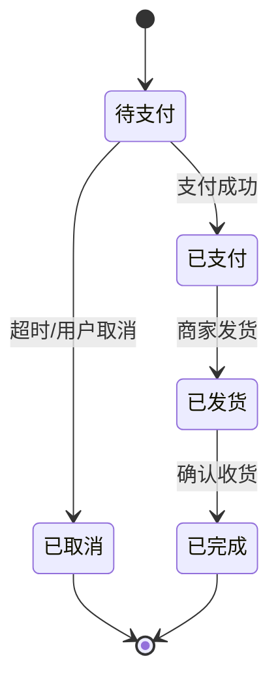

# 设计文档模板

> **适用范围**：概要设计（HLD）/ 详细设计（LLD）/ 技术方案文档。
> **图表提示**：优先使用 Mermaid 绘制架构图、时序图、状态图。为兼容 Typora 等渲染器，避免使用 `subgraph` 嵌套和复杂 CSS。

## 元信息

| 项目 | 内容 |
|:-----|:-----|
| 文档标题 | [功能/模块名称] 设计文档 |
| 文档版本 | v1.0 |
| 作者 | [姓名] |
| 评审人 | [姓名] |
| 创建日期 | YYYY-MM-DD |
| 最后更新 | YYYY-MM-DD |
| 状态 | 草案 / 评审中 / 已通过 / 已废弃 |

## 1. 背景与目标

**章节内容意图**：阐述业务背景、问题定义与设计目标，为后续技术决策提供上下文。

**规范化写作指南**：

- **业务背景**：当前业务痛点、触发此设计的业务需求或事件。
- **问题定义**：用数据或事实描述问题的严重性（影响范围、频次、损失）。
- **设计目标**：用 SMART 原则定义可衡量的目标（性能指标、可用性指标等）。
- **非目标**：明确不在本次设计范围内的事项，避免范围蔓延。

**模板示例**：

- **背景**：当前订单系统在促销高峰期频繁超时，P99 延迟达 3 秒，影响用户下单体验。
- **目标**：
  - 下单接口 P99 延迟降至 200ms 以内。
  - 支持 5,000 QPS 峰值流量。
  - 订单数据最终一致性保障时延 < 5 秒。
- **非目标**：
  - 不涉及支付系统重构。
  - 不涉及历史数据迁移。

## 2. 方案概述

**章节内容意图**：以一页纸的篇幅描述整体方案，便于快速理解全局。

**规范化写作指南**：

- 用 3-5 句话概括核心方案。
- 附一张核心架构图（Mermaid 格式）。
- 列出关键设计决策（2-5 条），并说明每条决策的取舍依据。

**模板示例**：

本方案采用"异步削峰 + 分库分表 + 读写分离"架构。订单写入通过 Kafka 异步化，数据库按用户 ID 分 16 库 16 表，读操作走从库。核心设计决策：

1. 选择 Kafka 而非 RocketMQ：团队已有 Kafka 运维经验，且吞吐量满足需求。
2. 选择用户 ID 而非订单 ID 作为分片键：保证同一用户的订单在同一分库，支持用户维度查询。

## 3. 详细设计

**章节内容意图**：按模块/流程展开设计细节，指导开发实现。

**规范化写作指南**：

- 按模块划分章节，每个模块说明：职责、接口定义、核心流程、异常处理。
- 核心流程使用时序图描述，状态流转使用状态图描述。
- 数据模型使用 ER 图或数据字典描述。
- 异常处理必须覆盖：失败场景、重试策略、降级方案、告警与人工介入。

### 3.1 [模块名称]

**职责**：[一句话描述]

**核心流程**：

**状态流转**：

**接口定义**：

| 方法 | 路径 | 说明 | 请求体 | 响应 |
|:-----|:-----|:-----|:-------|:-----|
| POST | /orders | 创建订单 | OrderRequest | OrderResponse |
| GET | /orders/{id} | 查询订单 | - | OrderDetail |

**异常处理**：

| 异常场景 | 处理策略 | 重试 / 降级 | 告警与人工介入 |
|:---------|:---------|:------------|:---------------|
| Kafka 发送失败 | 同步降级写入 DB，异步补偿 | 不重试，立即降级 | 发送告警，DB 补偿由定时任务自动完成 |
| 订单落库失败 | 重试 3 次，间隔 500 ms | 3 次后写入死信队列 | 死信队列告警，人工排查后重新消费 |
| 重复消费 | 幂等校验（orderId 唯一约束） | 直接跳过重复消息 | 无需告警，日志记录 |

## 4. 数据设计

**章节内容意图**：定义存储结构、分片策略、索引设计、数据生命周期。

**规范化写作指南**：

- 核心表提供数据字典。
- 说明分库分表规则、分片键选择理由。
- 说明索引设计及覆盖场景。
- 说明数据安全策略：加密字段、脱敏规则、访问权限控制。
- 说明数据生命周期：归档、清理策略。

**模板示例**：

| 表名 | 字段名 | 类型 | 约束 | 说明 |
|:-----|:-------|:-----|:-----|:-----|
| t_order | id | BIGINT | PK | 订单 ID（雪花算法） |
| t_order | user_id | BIGINT | NOT NULL, INDEX | 用户 ID（分片键） |
| t_order | status | TINYINT | NOT NULL | 0:待支付 1:已支付 2:已取消 |
| t_order | amount | DECIMAL(10,2) | NOT NULL | 订单金额 |

- **分片规则**：按 `user_id` 取模，16 库 × 16 表。
- **索引**：`idx_user_id_create_time` 覆盖订单列表查询。
- **数据安全**：金额字段使用 AES-256-GCM 加密存储。
- **生命周期**：保留 3 年，超 1 年归档至冷存储。

## 5. 非功能设计

**章节内容意图**：覆盖高可用、性能、安全、可观测性等非功能性需求。

**规范化写作指南**：

- **高可用**：部署架构（多副本 / 跨可用区）、容灾策略（RTO / RPO）。
- **性能**：容量评估、性能基线、压测结果。
- **安全**：认证授权、数据加密、输入校验、审计日志。
- **可观测性**：指标监控、日志采集、链路追踪、告警规则。
- **兼容性**：接口兼容策略（版本管理、灰度发布）。

## 6. 风险与待决事项

**章节内容意图**：透明呈现已知风险和未决问题，避免遗漏。

**模板示例**：

| # | 风险/待决事项 | 影响 | 缓解措施/决策期限 |
|:--|:-------------|:-----|:-----------------|
| 1 | Kafka 集群容量是否支撑双 11 峰值 | 高 | 8 月前完成压测验证 |
| 2 | 分库分表后跨分片查询方案待定 | 中 | 7 月前确定 ES 同步方案 |

## 7. 评审记录

| 日期 | 评审人 | 评审意见 | 处理结果 |
|:-----|:-------|:---------|:---------|
| YYYY-MM-DD | 张三 | 建议增加幂等方案说明 | 已补充在 3.1 异常处理 |

## 使用提示

- 设计方案必须有明确的「非目标」边界，防止评审时范围蔓延。
- 架构图优先使用 Mermaid，复杂场景可补充外部图片链接。
- 所有性能指标必须附带测试条件（压测工具、数据规模、环境配置），否则视为不可衡量。
