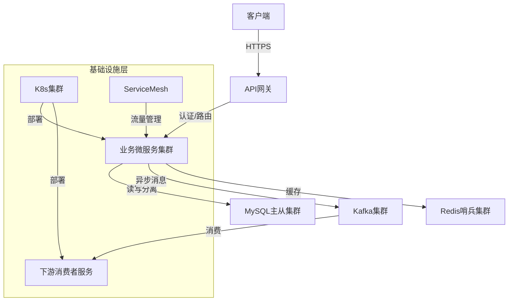

# [项目/模块名称] 说明文档模板

> **适用范围**：项目 README、模块总览文档、技术入口文档。
> **图表提示**：优先使用 Mermaid 绘制架构图。为兼容 Typora 等渲染器，避免使用 `subgraph` 嵌套和复杂 CSS。

## 概述

**章节内容意图**：作为项目入口，简明扼要阐述项目的商业价值、核心定位和技术边界，帮助读者快速建立全局认知。

**规范化写作指南**：

- **价值导向**：聚焦业务目标与痛点解决，避免技术细节堆砌。
- **标准化信息**：包含项目名称、版本、所属部门/产品线、维护团队、项目状态（如：生产/测试/已废弃）。
- **访问入口**：提供关键链接（如 API 文档、管理后台、监控系统、日志平台、问题跟踪系统）。
- **沟通与支撑渠道**：明确项目负责人、备份负责人、On-Call 联系方式、紧急问题升级路径。
- **合规声明**：简要说明遵循的行业标准或法规（如 ISO 27001、PCI-DSS、GDPR）。

**模板示例**：

- **项目名称**：XX 分布式交易服务平台
- **版本**：v2.5.0
- **项目状态**：生产（生产 / 预发 / 测试 / 已废弃）
- **归属部门**：金融科技部
- **维护团队**：架构组
  - 项目负责人：张三（zhangsan@xxx.com）
  - 备份负责人：李四（lisi@xxx.com）
  - On-Call：xxx-oncall@xxx.com（7×24 小时）
  - 紧急升级路径：先联系 On-Call → 未响应联系项目负责人 → 部门技术总监
- **核心价值**：构建高可用金融级交易系统，日均处理交易量超 1000 万笔，P99 延迟 < 50 ms。
- **关键链接**：
  - API 文档：[https://xxx.com/api-docs]
  - 监控平台：[https://xxx.com/prometheus]
  - 日志平台：[https://xxx.com/kibana]
  - 问题跟踪：[Jira 项目 ID / 看板链接]
  - 知识库：[Confluence 空间链接]
- **合规声明**：满足 GDPR 数据保护要求，关键交易符合 PCI-DSS Level 1 标准。

## 前置知识

**章节内容意图**：明确阅读本项目的必备知识储备，帮助新成员评估学习成本并快速补齐短板。

**规范化写作指南**：

- **必读文档**：列出外部官方文档和内部规范文档。
- **技能要求**：明确编程语言、框架、中间件的技能深度要求。

**模板示例**：

- **必读文档**：
  - 《Spring Boot 官方文档》第 1-10 章
  - 《阿里巴巴 Java 开发手册》嵩山版
  - 公司内部《微服务开发规范 v3.0》
- **技能要求**：
  - 熟练掌握 Java 17+，深入理解 Spring Boot、MyBatis-Plus。
  - 了解 Docker、Kubernetes 基本概念及常用命令。
  - 熟悉 MySQL 索引优化、事务隔离级别及锁机制。

## 架构设计

**章节内容意图**：通过可视化图表与文字结合，呈现系统整体架构、模块划分及技术决策，支撑技术评审、故障定界与扩展规划。

**规范化写作指南**：

- **图表规范**：使用 mermaid 绘制，分层清晰（接入层、应用层、数据层、基础设施层），标注核心组件和流向。
- **技术决策透明**：
  - 解释设计原则（如前后端分离、微服务拆分、读写分离）。
  - 解释关键架构选择（如微服务拆分粒度、消息队列选型、数据库选型）的考量因素（性能、生态、团队能力、运维成本）。
- **非功能性设计**：必须涵盖高可用（主备/集群/多活）、容灾（RTO/RPO）、安全（认证授权、网络隔离）、可观测性（日志、指标、链路追踪）。

**模板示例**：



- **设计说明**：
  - **接入层**：使用云厂商 API 网关 + Nginx，负责 TLS 终结、限流、防重放攻击。
  - **服务层**：基于 Kubernetes 部署 Spring Boot 微服务，服务间采用 gRPC 同步调用，并通过 Kafka 解耦关键异步流程。
  - **高可用**：业务服务多副本（3）跨可用区部署，MySQL 采用一主两从半同步复制，Redis 使用哨兵模式。
  - **容灾**：支持同城双活，RPO < 5分钟，RTO < 30分钟。
  - **可观测性**：Metrics 暴露至 Prometheus，Logs 采集至 ELK，Traces 集成 SkyWalking。

## 技术选型

**章节内容意图**：明确技术栈及版本约束，确保团队技术一致性，规避兼容性问题，并为环境搭建、故障排查提供依据。

**规范化写作指南**：

- **版本精确化**：以表格形式列出所有核心组件的具体版本号（如 Spring Boot 3.6.2）。
- **分类清晰**：按语言框架、数据库、中间件、工具链、基础设施等维度划分。
- **选型理由**：对关键组件的选用逻辑进行简要说明（如性能、社区活跃度、团队技术栈契合度）。
- **依赖管理**：说明依赖升级策略（如固定大版本、定期升级计划、自动化安全扫描工具）。

**模板示例**：

| 分类       | 组件名称    | 版本   | 说明               | 选型理由             |
| :--------- | :---------- | :----- | :----------------- | :------------------- |
| 语言       | OpenJDK     | 17.0.6 | Java 开发环境      | LTS 版本，长期支持   |
| 框架       | Spring Boot | 3.6.2  | 核心业务框架       | 生态成熟，团队熟悉   |
| 应用服务器 | Undertow    | 嵌入版 | 替代 Tomcat        | 更高并发，更低内存   |
| 关系数据库 | MySQL       | 8.0.32 | 事务型数据存储     | 稳定，社区活跃       |
| 缓存       | Redis       | 7.0.11 | 缓存与分布式锁     | 高性能，数据结构丰富 |
| 消息队列   | Kafka       | 3.5.1  | 异步解耦、削峰     | 高吞吐，持久化好     |
| 注册/配置  | Nacos       | 2.2.3  | 服务注册与配置管理 | 支持双端，国内主流   |
| 构建工具   | Maven       | 3.9.2  | 项目构建           | 团队规范             |
| 容器化     | Docker      | 24.0.x | 容器化运行         | 环境标准化           |
| 编排       | Kubernetes  | 1.27+  | 容器编排           | 公司统一基础设施栈   |

- **依赖升级策略**：所有核心依赖固定大版本，每季度进行一次兼容性评估和安全补丁更新，使用 Dependabot 或公司内部安全扫描工具自动化检测高危漏洞。

## 核心功能

**章节内容意图**：以用户故事或业务场景为维度，定义系统核心能力，作为需求验证、测试用例设计与验收基准。

**规范化写作指南**：

- **场景化描述**：采用“作为[角色]，我需要[功能]，以便[达成目标]”格式。
- **功能边界清晰**：明确功能支持范围与限制条件（如支持的交易类型、数据量级）。
- **状态标识**：标注功能开发状态（已上线 / 开发中 / 规划中 / 已废弃）。
- **性能指标**：关键功能需附带明确的非功能指标（如 TPS、QPS、响应时间、并发用户数）。

**模板示例**：

- **用户管理（已上线）**
  - **场景**：作为注册用户，我需要通过 OAuth 2.0 登录系统，以安全访问个人订单。
  - **能力**：支持 GitHub/企业微信 OAuth 登录，支持动态角色与权限配置。
  - **性能**：登录接口 P99 < 200ms，支持 500 QPS。
- **订单处理（已上线）**
  - **场景**：作为买家，我需要创建订单并完成支付，以便购买商品。
  - **能力**：实时订单撮合，支付成功后超时自动取消（30分钟）。
  - **性能**：下单接口 TPS ≥ 2000，P99 延迟 < 100ms。
  - **约束**：分布式事务保障最终一致性。
- **报表导出（规划中）**
  - **能力**：支持财务按需导出日/月交易报表。
  - **性能**：百万级数据导出时间 < 2分钟。

## 功能设计

**章节内容意图**：详细描述各模块的职责、接口定义和交互规范，指导开发和联调。

**规范化写作指南**：

- 按领域划分模块（如用户、订单、支付、通知）。
- 提供接口文档示例（路径、方法、请求参数、响应结构、错误码）。
- 说明模块间通信协议（如 HTTP/JSON、gRPC/Protobuf）与序列化方式。
- 明确模块间依赖关系与调用边界。

**模板示例**：

- **订单模块**
  - **职责**：订单创建、支付回调处理、订单状态流转、超时取消。
  - **对外接口（HTTP/JSON）**：
    - `POST /api/v1/orders`：创建订单。
      - 请求：`{"amount": 100.50, "productId": "PROD-123"}`
      - 响应：`{"orderId": "ORD-10001", "status": "CREATED"}`
      - 错误码：`1001`（库存不足）、`1002`（参数校验失败）。
    - `GET /api/v1/orders/{orderId}`：查询订单详情。
  - **依赖**：用户模块（获取用户信息）、库存模块（扣减库存）、支付网关（发起支付）。

## 存储设计

**章节内容意图**：定义数据表结构、关系、索引及存储策略，指导数据库变更评审与性能优化。

**规范化写作指南**：

- 提供核心表的 ER 图或数据字典（表名、字段、类型、约束、说明）。
- 说明分库分表规则、分区策略及索引设计。
- **必须说明数据安全策略**：敏感字段加密、数据脱敏规则、访问权限控制。
- **说明数据生命周期**：归档、清理策略（如保留时限）。

**模板示例**：

- **ER 图**：

  - 用户表（`t_user`）1:N 订单表（`t_order`）。

- **核心表数据字典**：
  | 表名 | 字段名 | 类型 | 约束 | 默认值 | 说明 | 枚举值 |
  | :------ | :---------- | :------------ | :----------------- | :----- | :------------------- | :------------------------- |
  | t_order | id | BIGINT | PK, AUTO_INCREMENT | - | 订单ID（雪花算法） | - |
  | t_order | user_id | BIGINT | NOT NULL, INDEX | - | 用户ID（分片键） | - |
  | t_order | status | TINYINT | NOT NULL | 0 | 订单状态 | 0:待支付 1:已支付 2:已取消 |
  | t_order | amount | DECIMAL(10,2) | NOT NULL | 0.00 | 订单金额（元） | - |
  | t_order | create_time | DATETIME | NOT NULL | NOW() | 创建时间 | - |
  | t_order | update_time | DATETIME | NOT NULL | NOW() | 更新时间（自动更新） | - |
- **分库分表规则**：按 `user_id` 哈希取模，共 16 个库，每个库 16 张表（`t_order_x`）。
- **索引设计**：`idx_user_id_create_time` 覆盖订单列表查询。
- **数据安全**：
  - 敏感字段（手机号、身份证）使用 AES-256-GCM 算法加密存储。
  - 应用日志中禁止打印明文敏感信息和生产访问令牌。
- **生命周期管理**：订单数据保留 3 年，超过 1 年的订单自动归档到历史表或冷存储。

## 安全设计

**章节内容意图**：系统化说明系统的安全策略、认证授权机制、数据保护措施。

**规范化写作指南**：

- **认证与授权**：使用的协议（OAuth2/OIDC/SAML）、权限模型（RBAC/ABAC）。
- **网络安全**：TLS版本、证书管理、防火墙规则、WAF配置。
- **数据安全**：加密算法、密钥管理、脱敏规则。
- **审计日志**：记录哪些操作、保留时长、访问控制。
- **漏洞管理**：定期扫描工具、修复SLA、渗透测试频率。
- **合规要求**：满足的具体安全标准（ISO 27001、等保三级等）。

**模板示例**：

- **认证授权**：采用 OAuth 2.0 + JWT，支持 SSO 单点登录，权限基于 RBAC 模型。
- **网络安全**：
  - 所有外部通信强制 TLS 1.3。
  - API 网关配置 WAF 规则，拦截 SQL 注入/XSS 攻击。
  - 内网服务间调用启用 mTLS 双向认证。
- **数据安全**：
  - 敏感字段使用 AES-256-GCM 加密，密钥由 HashiCorp Vault 管理。
  - 日志中手机号/身份证自动脱敏（显示前3后4位）。
- **审计日志**：记录所有写操作（创建/更新/删除），保留 180 天，仅安全团队可访问。
- **漏洞管理**：
  - 每周自动扫描依赖漏洞（Dependabot）。
  - 高危漏洞 24 小时内修复，中危 7 天内修复。
  - 每年进行一次第三方渗透测试。

## 性能设计

**章节内容意图**：明确系统的性能基线、容量上限及扩容策略，支撑资源申请和容量规划。

**规范化写作指南**：

- **性能基线**：关键接口的 TPS/QPS、响应时间（P50/P90/P99）、并发用户数。
- **压测报告**：最近一次压测的时间、工具、场景、结果链接。
- **容量规划**：当前资源使用情况、预计增长趋势、扩容触发条件。
- **瓶颈分析**：已知的性能瓶颈及优化计划。
- **限流降级**：限流策略（令牌桶/滑动窗口）、降级方案。

**模板示例**：

- **性能基线**（2026-04 压测数据）：
  | 接口 | TPS | P99延迟 | 并发用户 |
  | :----------- | :--- | :------ | :------- |
  | 下单接口 | 2000 | 95ms | 500 |
  | 订单查询接口 | 5000 | 45ms | 1000 |
  | 支付回调接口 | 1500 | 120ms | 300 |
- **容量规划**：
  - 当前资源配置：8核16G × 6实例，MySQL 16核32G。
  - 预计 QPS 年增长 30%，当 CPU 持续 > 70% 时触发扩容。
  - 扩容策略：K8s HPA 自动扩容，最大 12 实例。
- **限流降级**：
  - API 网关配置令牌桶限流：下单接口 1000 QPS，超出返回 429。
  - 非核心功能（如推荐服务）在系统负载 > 80% 时自动降级。

## 快速开始 / 使用指南

**章节内容意图**：提供从 0 到 1 配置开发、测试环境的详细步骤，确保新成员（开发、测试）在可控时间内完成环境准备。

**规范化写作指南**：

- **分步骤操作**：使用有序列表 + 代码块清晰呈现流程。
- **环境依赖**：明确软硬件要求（如 JDK 17、MySQL 8.0、Docker Desktop、Kubernetes 集群访问权限）。
- **配置说明**：提供最少必需的环境变量、配置文件示例或模板（如 `application-dev.yml`）。
- **验证步骤**：给出启动后验证服务健康状态的命令、接口或测试用例。

**模板示例**：

1. **环境要求**：

- JDK 17+（`$JAVA_HOME` 配置正确）
- Maven 3.9+
- Docker Desktop（内存 8 GB）/ 公司 K8s 开发集群访问权限
- IDE 插件：Lombok、EditorConfig

2. **克隆代码**：

   ```shell
   git clone https://git.xxx.com/group/project.git
   cd project
   ```

3. **本地启动基础中间件**：

   ```shell
   cd docker/dev
   docker-compose up -d   # 启动 MySQL、Redis、Kafka（默认配置）
   ```

4. **修改配置文件**：

- 复制 `src/main/resources/application-dev.yml.template` 为 `application-dev.yml`。
- 填写最小必要配置（数据库连接、Redis 地址等，默认可与 docker-compose 配置对齐）。

5. **启动项目**：

   ```shell
   mvn clean spring-boot:run -Dspring-boot.run.profiles=dev
   ```

6. **验证**：

- 访问健康检查接口：`curl http://localhost:8080/actuator/health`
- 执行冒烟测试用例：`mvn test -Dtest=SmokeTest`

## 部署与运维

**章节内容意图**：提供生产环境的部署流程、监控告警、故障处理等运维指南。

**规范化写作指南**：

- **部署架构**：生产/预发/测试环境的拓扑图。
- **部署流程**：CI/CD 流水线说明、发布策略（蓝绿/灰度/滚动）。
- **配置管理**：不同环境的配置差异、敏感信息管理（Vault/密钥管理服务）。
- **监控告警**：关键指标阈值、告警规则、告警接收人。
- **日志规范**：日志级别、日志格式、日志保留策略。
- **备份与恢复**：数据库备份策略、恢复演练频率。
- **应急预案**：常见故障的处理预案（如服务宕机、数据丢失）。

**模板示例**：

- **部署架构**：

  ```mermaid
  graph LR
    A[GitLab CI] --> B[Jenkins]
    B --> C[K8s 集群-生产]
    C --> D[MySQL 主从]
    C --> E[Redis 哨兵]
  ```

- **发布策略**：采用蓝绿部署，新版本先部署到 Green 环境，验证通过后切换流量。
- **监控告警**：
  - CPU > 80% 持续 5 分钟 → 发送钉钉告警。
  - P99 延迟 > 200ms → 发送企业微信告警。
  - 错误率 > 1% → 电话通知 On-Call。
- **备份策略**：
  - MySQL 每日全量备份 + binlog 实时备份，保留 30 天。
  - 每季度进行一次恢复演练。

## 开发规范

**章节内容意图**：定义项目级代码风格、测试策略、审查门禁，以保证代码质量与一致性。

**规范化写作指南**：

- **编码规范**：明确遵循的外部标准（如《阿里巴巴 Java 开发手册》），以及团队内部特殊约定。
- **测试策略**：分单元测试、集成测试、端到端测试说明其范围和工具。
- **质量门禁**：
  - 设定测试覆盖率目标（如行覆盖率 ≥ 80%，分支覆盖率 ≥ 70%）。
  - 列出强制执行的静态检查工具（如 SonarQube）及阻断规则。
  - 代码审查（Code Review）流程：至少 1 名 Reviewer 批准，无严重问题。
- **Git 协作规范**：分支模型（如 Git Flow）、提交信息格式（如 `<type>(<scope>): <subject>`）。

**模板示例**：

- **编码规范**：
  - 遵循《阿里巴巴 Java 开发手册》嵩山版。
  - **额外约定**：禁止在业务代码中使用 `@Autowired` 字段注入，强制使用构造器注入。
  - 所有对外接口（API/RPC）必须有详细的 JavaDoc。
- **测试策略**：
  - 单元测试：JUnit 5 + Mockito，核心 Domain 层覆盖率 ≥ 90%。
  - 集成测试：@SpringBootTest + Testcontainers，覆盖主要数据访问和外部调用路径。
  - 性能测试：关键接口（如下单）通过 JMH 或 JMeter 提供基准报告。
- **质量门禁**：
  - SonarQube 扫描，新代码覆盖率 < 80% 或存在 Blocker/Critical 问题，无法合并至主分支。
  - 所有 PR 必须经过至少 1 名 Reviewer 批准且 CI（编译、单元测试、静态检查）全部通过。
- **Git 协作**：
  - 采用 `GitHub Flow` 变体：`main` 为生产分支，`feature/*` 用于开发，`hotfix/*` 用于紧急修复。
  - Commit 格式：`<type>(<scope>): <subject>`，`type` 包含 `feat`、`fix`、`docs`、`refactor` 等

## 变更管理与版本发布

**章节内容意图**：规范版本迭代、发布流程和回滚机制，确保变更可控。

**规范化写作指南**：

- **版本规范**：语义化版本号（SemVer）的使用规则。
- **发布频率**：常规发布周期、紧急发布流程。
- **发布检查清单**：发布前必须完成的检查项。
- **回滚策略**：回滚触发条件、回滚步骤、回滚时间目标。
- **变更记录**：最近 3 个版本的变更摘要。

**模板示例**：

- **版本规范**：遵循 SemVer 2.0，格式 `MAJOR.MINOR.PATCH`（如 v2.5.0）。
  - MAJOR：不兼容的 API 变更。
  - MINOR：向后兼容的功能新增。
  - PATCH：向后兼容的问题修正。
- **发布频率**：每两周一次常规发布（周四晚 20:00-22:00），紧急修复随时发布。
- **发布检查清单**：
  - [ ] 所有单元测试通过
  - [ ] SonarQube 扫描无 Blocker/Critical 问题
  - [ ] 数据库变更脚本已评审
  - [ ] 回滚方案已准备
  - [ ] 相关团队已通知（客服、运营）
- **回滚策略**：
  - 触发条件：发布后 30 分钟内错误率 > 5% 或 P99 延迟 > 500ms。
  - 回滚步骤：K8s 一键回滚到上一版本 → 验证健康检查 → 通知相关人员。
  - RTO 目标：< 10 分钟。
- **最近版本**：
  - v2.5.0（2026-05-01）：新增灰度发布功能。
  - v2.4.2（2026-04-15）：修复订单重复扣款问题。
  - v2.4.1（2026-04-01）：性能优化，下单接口 P99 从 150ms 降至 95ms。

## 常见问题与排查

**章节内容意图**：沉淀团队经验，加速日常问题定位与故障恢复。

**规范化写作指南**：

- 按问题类型/现象分类（启动失败、性能抖动、数据不一致、消息堆积等）。
- 提供系统性的排查步骤（从现象到日志、指标、配置等）以及最终解决方案。
- 建立定期回顾与更新机制（如每季度由团队梳理新增典型问题）。

**模板示例**：

- **问题分类：启动与连接**

  - **现象**：应用启动报 `Connection refused: MySQL`。
  - **排查步骤**：
    1. 检查 MySQL 容器/服务是否运行：`docker ps | grep mysql`。
    2. 确认连接配置：检查 `application-dev.yml` 中的 `url`、`username`、`password` 是否正确。
    3. 网络连通性：从应用容器/宿主机 `telnet mysql-host 3306`。
    4. 查看 MySQL 错误日志：`docker logs mysql-container`。
  - **解决方案**：修正配置或启动依赖的 MySQL 服务。

- **问题分类：消息堆积**
  - **现象**：Kafka 消费者组堆积量持续增加。
  - **排查步骤**：
    1. 查看消费者组状态：`kafka-consumer-groups --bootstrap-server ... --group ... --describe`。
    2. 检查下游消费者处理逻辑耗时或异常日志。
    3. 检查消费者实例数是否小于 Topic 分区数。
  - **解决方案**：根据根因增加消费者实例、优化处理函数、扩容分区。

## 项目规划

**章节内容意图**：跟踪项目后续开发计划、技术优化方向和技术债务，作为内部规划看板。

**规范化写作指南**：

- 使用表格区分优先级（P0/P1/P2）。
- 关联需求编号或问题单号，保证可追溯。
- 标注负责人和计划完成时间。
- 定期更新任务状态（进行中/已完成/已取消）。

**模板示例**：

| 优先级 | 任务描述                                            | 关联需求/问题 | 负责人 | 计划完成时间 | 状态   |
| :----- | :-------------------------------------------------- | :------------ | :----- | :----------- | :----- |
| P0     | 修复极端场景下 Kafka 消息重复消费引发的订单对账差异 | JIRA-1234     | 张三   | 2026-05-20   | 进行中 |
| P1     | 实现灰度发布能力，支持按流量比例切流                | TECH-567      | 李四   | 2026-06-15   | 规划中 |
| P2     | 优化订单查询慢 SQL，添加复合索引                    | #ISSUE-89     | 王五   | 2026-07-01   | 待开始 |

## 文档规范

**章节内容意图**：明确文档的责任人、更新频率、审核机制，确保文档持续有效。

**规范化写作指南**：

- **责任人**：文档的主要维护者和备份维护者。
- **更新触发条件**：什么情况下必须更新文档。
- **更新频率**：定期审查周期。
- **审核机制**：文档变更的审核流程。
- **版本管理**：文档的版本号与代码版本号的对应关系。

**模板示例**：

- **责任人**：
  - 主要维护者：张三（架构师）
  - 备份维护者：李四（技术负责人）
- **更新触发条件**：
  - 架构变更（新增/移除组件）
  - 技术栈升级（框架/中间件版本变更）
  - 核心接口变更（请求/响应结构变化）
  - 存储结构变更（新增/修改表结构）
  - 部署流程变更
- **更新频率**：
  - 每次版本发布后 3 个工作日内完成文档更新。
  - 每季度进行一次全面审查，确认文档与实际一致。
- **审核机制**：
  - 文档变更需经过至少 1 名团队成员 Review。
  - 重大变更（如架构调整）需技术总监审批。
- **版本管理**：
  - 文档版本号与代码版本号保持一致（如 v2.5.0）。
  - 历史版本文档归档至 `docs/archive/` 目录。

## 附录（可选）

- 相关协议文档链接（如业务时序图、领域模型图）。
- 术语表（中英文对照及解释）。
- 系统外部依赖清单（第三方服务、API、供应商）。
- 关键配置项完整说明。
- 参考架构设计文档、ADR（架构决策记录）链接。

## 备注

- 本模板为必选基础框架，每个企业级项目 / 模块必须建立对应文档。
- 根据实际项目情况可调整章节顺序或增删细节，但核心章节（概述、架构设计、技术选型、存储设计、开发规范）应保持完整。
- 文档应置于项目仓库根目录下（如 `README.md`），并随项目迭代同步更新，重大架构变更时须同步修订。
- 文档遵循团队 / 公司文档规范（如有）。
