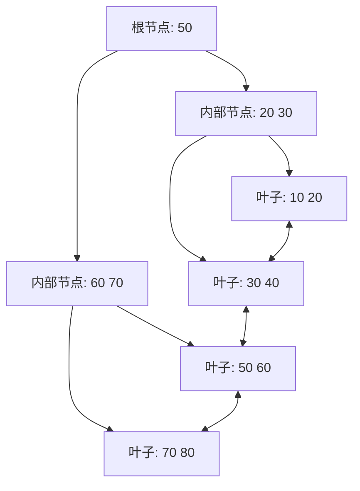

# 技术笔记文档模板

> **适用范围**：技术学习笔记、知识沉淀文档、专题技术深入分析。
> **核心定位**：体系化的技术知识梳理，兼顾深度理解与快速回顾。
> **图表提示**：架构类用 Mermaid graph，流程类用 sequenceDiagram，状态类用 stateDiagram。

## Frontmatter

```yaml
---
title: [技术名称] [主题]
date: YYYY-MM-DD HH:mm:ss
order: [排序号]
categories:
  - [一级分类]
  - [二级分类]
tags:
  - [标签]
permalink: /pages/[hash]/
---
```

**规范化写作指南**：

- `title` 采用 `[技术名称] [主题]` 格式，如 `Spring Boot 自动配置原理`、`MySQL 索引优化`。
- 若标题中包含冒号（`:`），必须用双引号包裹，避免 YAML 解析错误。
- `order` 控制同级文档的排列顺序。

## 文档标题

```markdown
# [技术名称] [主题]
```

## 引言/概述

**章节内容意图**：用 2-3 段话说明本文的技术背景、核心问题和阅读价值，帮助读者快速判断是否值得深入阅读。

**规范化写作指南**：

- **痛点切入**：从实际开发中遇到的问题或常见误区切入，引发共鸣。
- **范围声明**：明确本文覆盖什么、不覆盖什么。
- **前置知识**：如需特定基础知识，简要说明。

**模板示例**：

```markdown
在实际项目中，MySQL 慢查询是最常见的性能瓶颈之一。许多开发者知道"要加索引"，但对索引的底层数据结构和优化器选择逻辑缺乏深入理解，导致索引设计不合理、查询优化方向错误。

本文从 B+ 树的数据结构出发，系统梳理 InnoDB 索引的核心机制，并结合真实案例讲解索引优化的实战技巧。

> 阅读本文前，建议先了解 MySQL 的基本存储引擎和 SQL 语法。
```

## 核心概念

**章节内容意图**：定义本文涉及的核心概念和术语，建立统一认知。

**规范化写作指南**：

- 每个概念用 `###` 三级标题独立呈现。
- 先给出一句话定义，再展开解释。
- 使用类比辅助理解抽象概念。
- 专业术语首次出现时给出英文全称。

**模板示例**：

```markdown
### 聚簇索引（Clustered Index）

聚簇索引是 InnoDB 中数据行的物理存储顺序与索引顺序一致的索引结构。每张表有且仅有一个聚簇索引（通常基于主键）。

> 类比：聚簇索引就像字典的正文——按字母排列，翻到那一页就是实际内容。
```

## 原理剖析

**章节内容意图**：深入技术的底层机制和实现原理，帮助读者建立深度理解。

**规范化写作指南**：

- **分层递进**：从宏观架构到微观实现，逐层深入。
- **图文结合**：核心流程必须配图（Mermaid 或外部图片链接），纯文字描述原理时不超过 3 段。
- **源码佐证**：关键结论引用源码片段（不超过 10 行），标注源码版本。
- **对比分析**：与相似技术/方案进行对比，突出差异和选型依据。

**模板示例**：

```markdown
### InnoDB 的 B+ 树索引结构

InnoDB 使用 B+ 树作为索引的核心数据结构。与 B 树的关键差异在于：

| 特性     | B 树              | B+ 树                      |
| :------- | :---------------- | :------------------------- |
| 数据存储 | 所有节点存储数据  | 仅叶子节点存储数据          |
| 叶子链表 | 无                | 叶子节点通过双向链表连接    |
| 范围查询 | 需中序遍历        | 沿叶子链表顺序扫描，效率更高 |


```

## 实战案例

**章节内容意图**：通过真实场景的案例，将理论知识转化为可操作的实践指导。

**规范化写作指南**：

- **问题先行**：先描述问题现象（错误日志、慢查询、性能瓶颈）。
- **排查过程**：展示分析和定位问题的思路与工具。
- **解决方案**：给出具体的代码/配置变更，附带前后对比。
- **经验总结**：提炼可复用的经验教训或最佳实践。

**模板示例**：

```markdown
### 案例：联合索引失效导致的全表扫描

**问题现象**：`SELECT * FROM orders WHERE user_id = 123 AND create_time > '2026-01-01'` 执行耗时 2.3 秒。

**排查过程**：

```shell
EXPLAIN SELECT * FROM orders WHERE user_id = 123 AND create_time > '2026-01-01';
-- type: ALL, rows: 1,200,000（全表扫描）
```

**解决方案**：创建联合索引 `idx_user_id_create_time(user_id, create_time)`。

**效果**：执行耗时从 2.3 秒降至 3 ms，`EXPLAIN` 显示 `type: range`。

> **经验**：联合索引遵循最左前缀原则，高选择性列（如 `user_id`）应放在前面。
```

## 最佳实践

**章节内容意图**：提炼可直接落地的实践建议和注意事项。

**规范化写作指南**：

- 以有序列表或表格呈现，每条建议简洁明确。
- 区分"推荐做法"和"避免做法"。
- 附带具体的参数值、配置示例或代码片段。

**模板示例**：

```markdown
### 索引设计最佳实践

| 推荐做法                                       | 避免做法                           |
| :--------------------------------------------- | :--------------------------------- |
| 为 `WHERE` + `ORDER BY` 高频组合创建联合索引    | 对低选择性列（如性别）单独建索引    |
| 使用覆盖索引避免回表                            | 在索引列上使用函数（导致索引失效）  |
| 控制索引列数量（一般不超过 5 个）               | 盲目添加索引（增加写入开销）        |
```

## 常见问题与踩坑

**章节内容意图**：沉淀实践中容易犯的错误和常见误区。

**规范化写作指南**：

- 每条按"现象 → 原因 → 解决"结构组织。
- 附带错误日志或代码片段，便于搜索定位。

## 总结

**章节内容意图**：全文核心要点的浓缩回顾。

**规范化写作指南**：

- 用 3-5 条要点概括全文核心结论。
- 可附一张知识全景图（Mermaid mindmap 或外部图片）。
- 指出进一步学习的方向或推荐资源。

## 参考资料

**章节内容意图**：列出本文内容的权威来源，支撑可信度。

**规范化写作指南**：

- 优先列出官方文档链接。
- 书籍标注书名、作者和版次。
- 博客文章标注作者和发布时间。

```markdown
## 参考资料

- [MySQL 官方文档 - InnoDB 索引](https://dev.mysql.com/doc/refman/8.0/en/innodb-index-types.html)
- 《高性能 MySQL》第 4 版，O'Reilly
- [深入理解 B+ 树索引 @掘金](https://juejin.cn/post/xxx)
```

## 自检清单

- [ ] 引言清晰说明本文的技术背景和覆盖范围。
- [ ] 核心概念有明确定义，术语首次出现给出英文全称。
- [ ] 原理部分图文结合，不出现超过 3 段的纯文字描述。
- [ ] 实战案例遵循"问题→排查→解决→总结"结构。
- [ ] 代码块有正确的语言标注。
- [ ] 所有图片链接有效（包括外部图片链接）。
- [ ] 参考资料以官方文档和经典书籍为主。
- [ ] 中英文之间有空格，标点符号符合规范。
